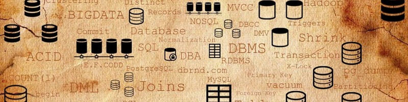
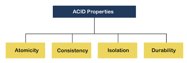
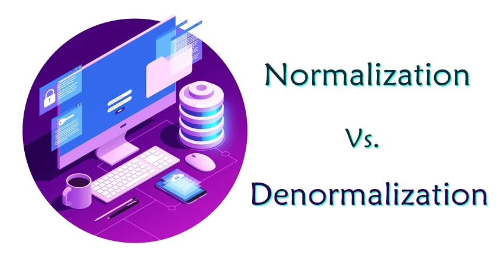
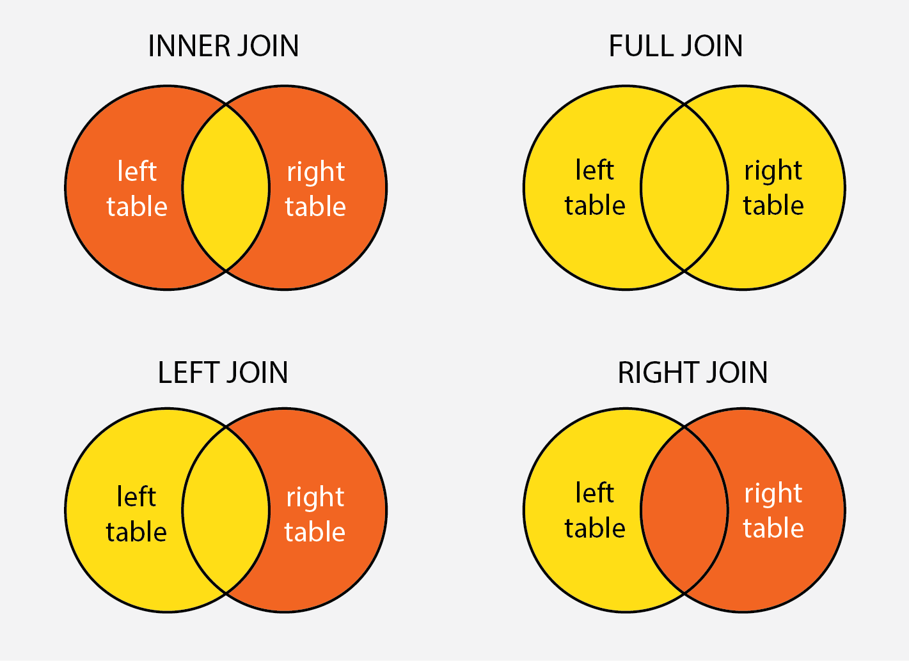

# 📚 Free E-Books on DBMS

Welcome to the **Free E-Books on DBMS** repository! 🎉 This space is a treasure trove for all book lovers and learners who want to dive deep into the world of **Database Management Systems (DBMS)**.

## ✨ Why This Repository?
This repository is designed to provide free access to a collection of e-books on DBMS. Whether you're a student, a professional, or a curious learner, you'll find valuable resources here to master the concepts of DBMS and enhance your skills.

### What You Can Do Here:
- 📖 **Download e-books**: Explore and download e-books to learn at your own pace.
- 📤 **Contribute your e-books**: Share your collection of e-books and help others in their learning journey.
- 🌟 **Level up your career**: Use these resources to gain knowledge, practice, and showcase your skills!

---

## 📂 How to Use This Repository

### For Readers:
1. Browse through the repository.
2. Navigate to the `books` folder.
3. Click on the e-book you want.
4. Use the **Download** button to get the e-book and start reading!

### For Contributors:
1. Fork this repository.
2. Add your e-books in an appropriate folder.
3. Create a pull request.
4. 🎉 Your contribution will be welcomed and appreciated!

---

## 💬 Have Questions or Suggestions?
Feel free to ask for any queries or suggestions:
[**DM here! @**] <v.nirmalaresearch@gmail.com>
Stay updated with the latest coding tips, tricks, and resources!

---

## 📢 Let's Build a Community Together

- Your contributions make this repository better. Share your resources and knowledge.
- Don’t forget to give this repository a ⭐ to help it reach more learners!

---

> **Disclaimer**: All e-books shared here are intended for educational purposes only. Please ensure you have the right to share the content you're uploading.

### My Personal Favourite DBMS Books 📚
- ✅ R.Elmasri, S.B.Navathe. Fundamentals of Database Systems, Addison Wesley, Seventh
Edition, 2016. 
- ✅ Kristina Chodorow and Michel Dirolf. MongoDB: The Definitive Guide, O'Reilly,
Publications, Second Edition, 2013.
- ✅ Henry F.Kort, Abraham Silberschatz, Sudarshan. Database System Concepts, McGraw
Hill, Sixth Edition, 2010.
- ✅ Raghu Ramakrishnan, Johannes Gehrke. Database Management Systems,
McGraw Hill, Third Edition, 2003.

### Courses 🎓

| Course Name                                                  |  Link                                                                                                                            |
|--------------------------------------------------------------|----------------------------------------------------------------------------------------------------------------------------------|
| MIT Course                                                   | [Link](https://ocw.mit.edu/courses/electrical-engineering-and-computer-science/6-830-database-systems-fall-2010/lecture-notes/)  |
| SQL Tutorial: Learn SQL with MySQL Database -Beginner2Expert | [Link](https://www.udemy.com/course/sql-tutorial-learn-sql-with-mysql-database-beginner2expert/)                                 |
| NPTEL Course                                                 | [Link](https://nptel.ac.in/courses/106105175/1)                                                                                  |
| SQL for Beginners: Learn SQL using MySQL and Database Design | [Link](https://www.udemy.com/course/sql-for-beginners-course/)                                                                   |
| Introduction to Structured Query Language (SQL)              | [Link](https://www.coursera.org/learn/intro-sql)                                                                                 |
| Introduction to Relational Database and SQL                  | [Link](https://www.coursera.org/projects/introduction-to-relational-database-and-sql)                                            |

### Books 📚
| Book                                                                                       | Link                                                                            |
|--------------------------------------------------------------------------------------------|---------------------------------------------------------------------------------|
| Stanford Database Systems: The Complete Book                                               | [Link](http://infolab.stanford.edu/~ullman/dscb.html)                           |
| Designing Data-Intensive Applications                                                      | [Link](http://shop.oreilly.com/product/0636920032175.do)                        |
| Database Internals                                                                         | [Link](https://www.oreilly.com/library/view/database-internals/9781492040330/)  |
| Foundations of Databases                                                                   | [Link](http://webdam.inria.fr/Alice/)                                           |
| Readings in Database Systems, 5th Edition                                                  | [Link](http://www.redbook.io/)                                                  |
| Database Design and Implementation: Second Edition (Data-Centric Systems and Applications) | [Link](https://www.amazon.com/dp/3030338355)                                    |
| Principles of Distributed Database Systems, 4th ed                                         | [Link](https://www.amazon.com/dp/3030262529)                                    |
| Inside SQLite                                                                              | [Link](https://books.google.com/books/about/Inside_SQLite.html?id=QoxUx8GOjKMC) |
| Architecture of a Database System                                                          | [Link](https://dsf.berkeley.edu/papers/fntdb07-architecture.pdf)                |

### Talks 📣

| Title                                                            | Link                                                                            |
|------------------------------------------------------------------|---------------------------------------------------------------------------------|
| Data Structures and Algorithms for Big Databases                 | [Link](https://people.csail.mit.edu/bradley/BenderKuszmaul-tutorial-xldb12.pdf) |
| A Journey From A Quick HackTo A High-Reliability Database Engine | [Link](https://www.sqlite.org/talks/wroclaw-20090310.pdf)                       |

___

We hope this gets you interested in learning more about DBMS ✌️

# DBMS - Let's Learn Easy: 😎

Here we have basic level notes of DBMS. These questions will familiarize you with the most important DBMS concepts and help you ace your job interviews :raised_hands:

---
## General Questions on DBMS

### 1) What is DBMS?
A DBMS is software that manages databases, providing an interface to store, retrieve, and manipulate data efficiently and securely.

---

### 2) What is a Database?
A Database is an organized, consistent, and logical collection of data that can easily be updated, accessed, and managed. Database mostly contains sets of tables or objects which consist of records and fields. 

---

### 3) Explain the difference between a database and a DBMS?
A database is a collection of related data, while a DBMS is software used to manage, store, and retrieve data efficiently from the database.

---

### 4) Advantages of DBMS over File Systems?

- **Data Redundancy and Inconsistency**: \
Redundancy means repeating the data in a system. In a normal file system, there is a high chance that there can be various files of the same data used by different users for specific purposes. If any user changes the data in its files, then the changes are not reflected in all files. This creates inconsistency in the data, and it may lead to the failure of the system. But in the DBMS, there is only one repository of data, and multiple users can use it. If any user changes the data, then it is reflected to each user as they are using the same repository.

- **Data Sharing**: \
In the normal file system, data sharing is too difficult because file sharing is a complex task. In DBMS, all the data is centralized, so data sharing is a very easy task.

- **Data Concurrency**: \
When more than one user accesses the database simultaneously, then it is called concurrency. In a file system, when multiple users are using the files at the same time, then there may be a chance of anomalies in the data due to changes, and it does not provide any method to detect anomalies. But in DBMS, we have a locking system to detect the anomalies so we can protect the data.

- **Data Searching**: \
To search the data in a file system, we have to write a specific program and run it. In DBMS, we have query languages by which we can write small queries to get the data we want from the database. We can use various query languages, like MySQL, Oracle, etc., for a database to search and retrieve the data.

- **Data Integrity**: \
When we insert new data into the database, we require some specific constraints on the data like integer or not null, etc. The file system does not provide any system to check the constraints, whereas DBMS has the functionality to check the constraints on the data, and it allows user defined data types.

---

### 5) What is the different languages present in DBMS?

- **DDL(Data Definition Language)**:  It contains commands which are required to define the database. \ 
E.g., CREATE, ALTER, DROP, TRUNCATE, RENAME, etc.
- **DML(Data Manipulation Language)**: It contains commands which are required to manipulate the data present in the database. \
E.g., SELECT, UPDATE, INSERT, DELETE, etc.
- **DCL(Data Control Language)**:  It contains commands which are required to deal with the user permissions and controls of the database system. \
E.g., GRANT and REVOKE.
- **TCL(Transaction Control Language)**:  It contains commands which are required to deal with the transaction of the database. \
E.g., COMMIT, ROLLBACK, and SAVEPOINT.

---

### 6) ACID properties in DBMS?

ACID stands for Atomicity, Consistency, Isolation, and Durability in a DBMS these are those properties that ensure a safe and secure way of sharing data among multiple users.

- **Atomicity**: This property reflects the concept of either executing the whole query or executing nothing at all, which implies that if an update occurs in a database then that update should either be reflected in the whole database or should not be reflected at all.
- **Consistency**: This property ensures that the data remains consistent before and after a transaction in a database.
- **Isolation**: This property ensures that each transaction is occurring independently of the others. This implies that the state of an ongoing transaction doesn’t affect the state of another ongoing transaction.
- **Durability**: This property ensures that the data is not lost in cases of a system failure or restart and is present in the same state as it was before the system failure or restart.

---

### 7) Difference between the DELETE and TRUNCATE command in a DBMS?

- DELETE Command:
    - It removes rows from a table one by one with transaction logging
    - It can be rolled back if required.

- TRUNCATE Command:
    - It removes all rows at once without transaction logging.
    - It can't be rolled back.
 
---

### 8) What is meant by Normalization and Denormalization?

**Normalization** is a process of reducing redundancy by organizing the data into multiple tables. Normalization leads to better usage of disk spaces and makes it easier to maintain the integrity of the database.  

**Denormalization** is the reverse process of normalization as it combines the tables which have been normalized into a single table so that data retrieval becomes faster. JOIN operation allows us to create a denormalized form of the data by reversing the normalization. 

---

### 9) Different types of Normalization forms in a DBMS?

- 1NF: It is known as the first normal form and is the simplest type of normalization that you can implement in a database. A table to be in its first normal form should satisfy the following conditions:
    - Every column must have a single value and should be atomic.
    - Duplicate columns from the same table should be removed.
    - Separate tables should be created for each group of related data and each row should be identified with a unique column.
 
- 2NF: It is known as the second normal form. A table to be in its second normal form should satisfy the following conditions:
    - The table should be in its 1NF i.e. satisfy all the conditions of 1NF.
    - Every non-prime attribute of the table should be fully functionally dependent on the primary key i.e. every non-key attribute should be dependent on the primary key in such a way that if any key element is deleted then even the non_key element will be saved in the database.
 
- 3NF: It is known as the third normal form. A table to be in its third normal form should satisfy the following conditions:
    - The table should be in its 2NF i.e. satisfy all the conditions of 2NF.
    - There is no transitive functional dependency of one attribute on any attribute in the same table.
 
- BCNF: BCNF stands for Boyce-Codd Normal Form and is an advanced form of 3NF. It is also referred to as 3.5NF for the same reason. A table to be in its BCNF normal form should satisfy the following conditions:
    - The table should be in its 3NF i.e. satisfy all the conditions of 3NF.
    - For every functional dependency of any attribute A on B
(A->B), A should be the super key of the table. It simply implies that A can’t be a non-prime attribute if B is a prime attribute.

---

### 10) What is an Entity-Relationship Diagram (ER-Diagram)?  
An ER-Diagram is a visual representation of the relationships among entities in a database, showing how different tables are connected.

---

### 11) Different types of keys in a database?

- **Primary key**: The Primary key is an attribute in a table that can uniquely identify each record in a table. It is compulsory for every table.
- **Unique Key**: The unique key is very similar to the primary key except that primary keys don’t allow NULL values in the column but unique keys allow them.
- **Foreign key**: The Foreign key is a primary key from one table, which has a relationship with another table. It acts as a cross-reference between tables.

---

### 12) What is a lock. Explain the difference between a shared lock and an exclusive lock?

A database lock is a mechanism to protect a shared piece of data from getting updated by two or more database users at the same time. When a single database user or session has acquired a lock then no other database user or session can modify that data until the lock is released.

- **Shared lock**: Shared lock is required for reading a data item. In the shared lock, many transactions may hold a lock on the same data item. When more than one transaction is allowed to read the data items then that is known as the shared lock.

- **Exclusive lock**: When any transaction is about to perform the write operation, then the lock on the data item is an exclusive lock. Because, if we allow more than one transaction then that will lead to the inconsistency in the database.

---

### 13) What are Views in DBMS?

A view is a virtual table that is derived from one or more base tables or other views. It does not store any data itself but represents a tailored, pre-defined query that simplifies data retrieval. Views act as a layer of abstraction over the underlying tables, providing a more user-friendly and secure way to interact with the data.

**Benefits of using views**:

- **Data Abstraction**: Views allow users to work with a simplified representation of the data, hiding unnecessary details and complexity.
- **Security**: Views can be used to restrict access to certain columns or rows, providing a level of security by only showing specific data to specific users.
- **Simplified Querying**: Complex queries can be encapsulated within views, making it easier for users to retrieve the desired information without writing complex SQL statements.
- **Data Independence**: If the underlying schema changes, views can remain the same, and applications using the views will not be affected.

---

### 14) What is a Join? List its different types.

The SQL Join clause is used to combine records (rows) from two or more tables in a SQL database based on a related column between the two.

There are four different types of JOINs in SQL:

- **INNER JOIN**: Retrieves records that have matching values in both tables involved in the join. This is the widely used join for queries.
- **LEFT OUTER JOIN**: Retrieves all the records/rows from the left and the matched records/rows from the right table.
- **RIGHT OUTER JOIN**: Retrieves all the records/rows from the right and the matched records/rows from the left table.
- **FULL OUTER JOIN**: Retrieves all the records where there is a match in either the left or right table.

---

### 15) What is a Self-Join?
A self JOIN is a case of regular join where a table is joined to itself based on some relation between its own column(s). Self-join uses the INNER JOIN or LEFT JOIN clause and a table alias is used to assign different names to the table within the query.

---

### 16) What is a Cross-Join?
Cross join can be defined as a cartesian product of the two tables included in the join. The table after join contains the same number of rows as in the cross-product of the number of rows in the two tables. If a WHERE clause is used in cross join then the query will work like an INNER JOIN.

---

### 17) What is an Index? Difference between Clustered and Non-Clustered Index?

A database index is a data structure that provides a quick lookup of data in a column or columns of a table. It enhances the speed of operations accessing data from a database table at the cost of additional writes and memory to maintain the index data structure.

#### Difference between Clustered and Non-Clustered Index

- Clustered index modifies the way records are stored in a database based on the indexed column. A non-clustered index creates a separate entity within the table which references the original table.
- Clustered index is used for easy and speedy retrieval of data from the database, whereas, fetching records from the non-clustered index is relatively slower.
- In SQL, a table can have a single clustered index whereas it can have multiple non-clustered indexes.

---

### Thanks for Reading 

---

###

###

---

